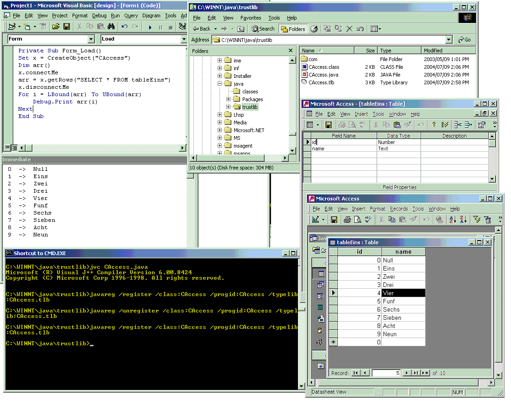



## Invoking a Java Class from VB Project and getting some data from an Access file\.

### Description

This mini tutorial explains how you can create a Java class and the invoking it from a VB project, this java class gets some data from an Access file and will show it in the VB project. Of course you need the Microsoft SDK for Java 4.0, microsoft removed it from its site so I found it in another web site, I included the link within my mini tutorial.
 
### More Info
 

             |
---                |---
**Submitted On**   |2004-07-09 15:16:28
**By**             |[foxsermon](https://github.com/Planet-Source-Code/PSCIndex/blob/master/ByAuthor/foxsermon.md)
**Level**          |Advanced
**User Rating**    |5.0 (15 globes from 3 users)
**Compatibility**  |VB 5\.0, VB 6\.0, ASP \(Active Server Pages\) 
**Category**       |[OLE/ COM/ DCOM/ Active\-X](https://github.com/Planet-Source-Code/PSCIndex/blob/master/ByCategory/ole-com-dcom-active-x__1-29.md)
**World**          |[Visual Basic](https://github.com/Planet-Source-Code/PSCIndex/blob/master/ByWorld/visual-basic.md)
**Archive File**   |[Invoking\_a176782792004\.ZIP](https://github.com/Planet-Source-Code/foxsermon-invoking-a-java-class-from-vb-project-and-getting-some-data-from-an-access-file__1-54843/archive/master.zip)

### Source Code

I did want to write this mini tutorial cause is more useful when someone includes a few screenshots in the documents. it helps more and gives you an idea if you are doing the right thing.   I included a doc file, it contains everything that you may need, also includes a couple of examples.  please if you have any problem, let me know, like Ruahine says:   go do something nice for someone else.  his site is www.ruahine.com  Of course dont forget to vote for this article.  thanks and kind regards from Mexico City.  Final Note Thank so much to stardeveloper, specially to Faisal Kahn for his article. 
http://www.stardeveloper.com/articles/display.html?article=2000030901&page=1  

